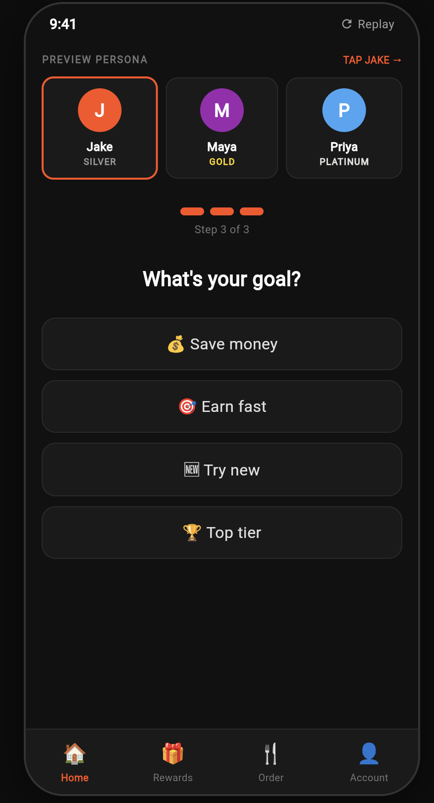
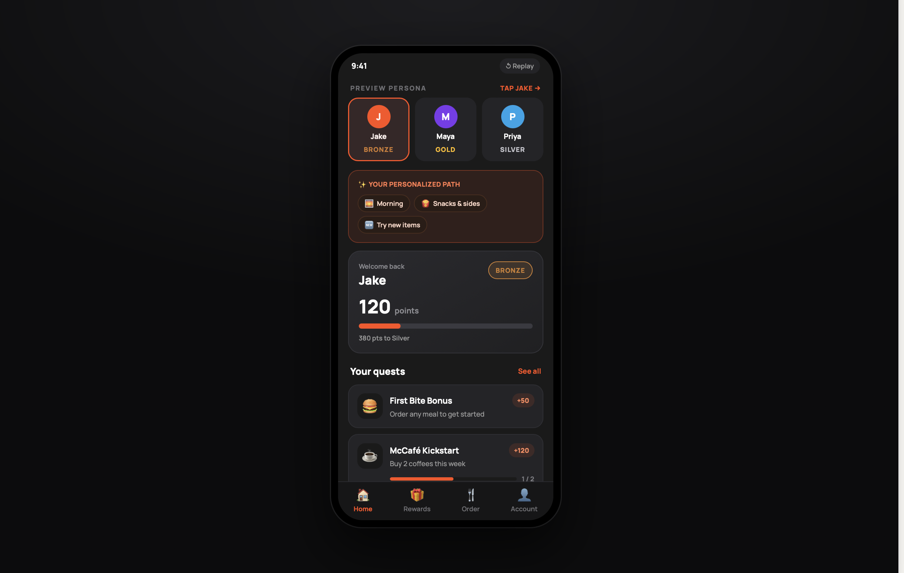
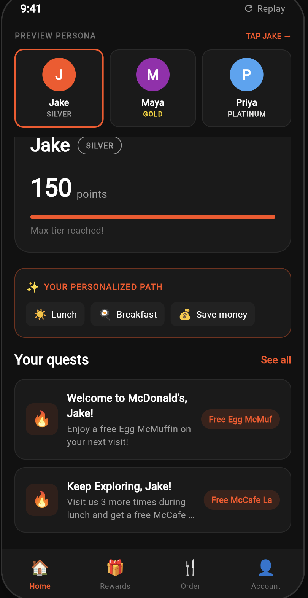
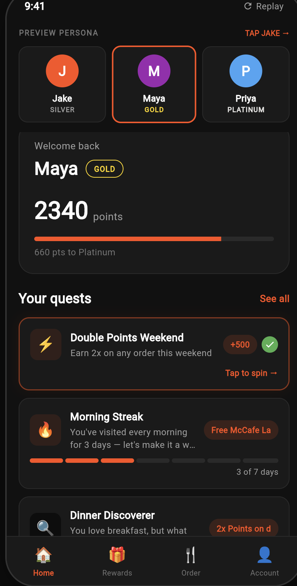
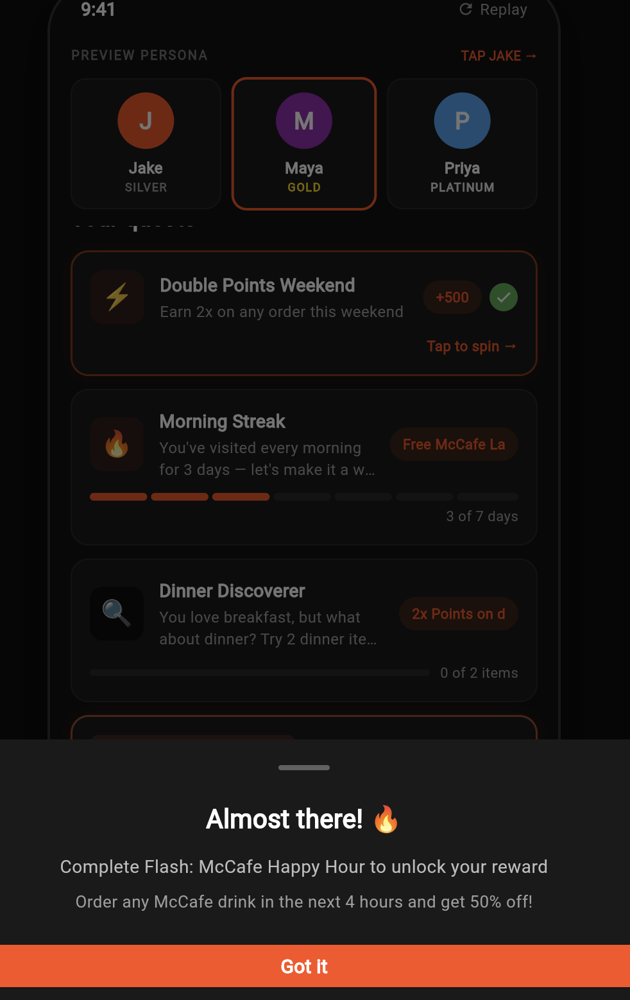
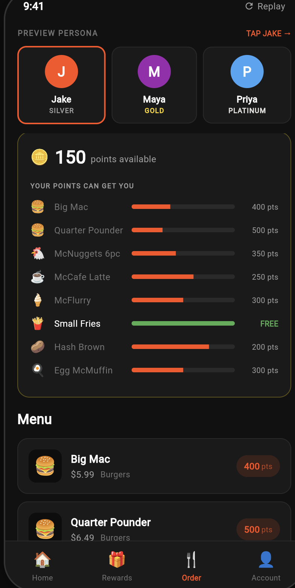
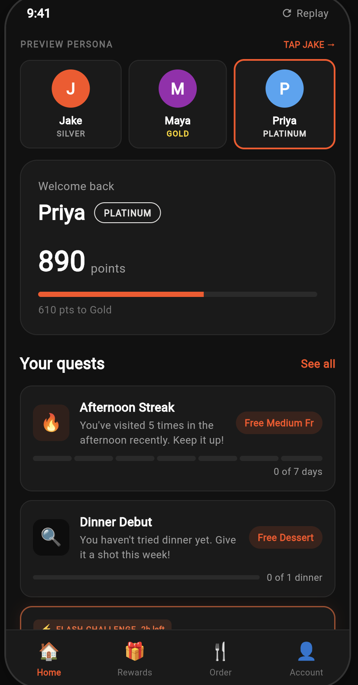

# FlameRewards

### AI-Powered Loyalty Platform for QSR & Retail

> Flutter SF Hackathon 2026 | Demonstrated with McDonald's

---

**The Problem:** Loyalty apps are broken. Every Gold member sees the same "Buy 5 Get 1 Free" quest. A breakfast regular and a lunch-only visitor get identical challenges. 73% of loyalty members disengage within 90 days because the experience feels generic.

**Our Solution:** An AI-powered loyalty platform where quests, rewards, and gamification are generated in real-time based on each member's actual buying behavior. No two members see the same experience. The UI literally generates itself.

**McDonald's is the demo retailer.** The platform works for any QSR, retail, grocery, or subscription brand.

---

## See It In Action

<p align="center">
  
  
  
</p>

<p align="center">
  <em>Jake (New User): Onboarding quiz → AI reads answers + cohort data → generates personalized quests</em>
</p>

<p align="center">
  
  
  
</p>

<p align="center">
  <em>Maya (Gold): AI-generated streak/discovery quests → Spin wheel reward → Points-based ordering</em>
</p>

<p align="center">
  
</p>

<p align="center">
  <em>Priya (Platinum): VIP quests with flash challenges, referrals, and streak protection</em>
</p>

---

## The GenUI Innovation

### What We Built

A **multi-agent AI pipeline** that sits between your customer data and your loyalty UI. Instead of a product manager manually writing quest content for each segment, the AI reads two signals and composes the experience:

```
SIGNAL 1: Member's actual purchase history
  → Maya ordered Egg McMuffin 6x, McCafe Latte 4x, Big Mac 2x
  → She visits mornings only, never lunch or dinner
  → 12-day active streak

SIGNAL 2: Cohort behavior patterns from similar users
  → "Gold morning regulars who add lunch items convert
     to Platinum 74% of the time"
  → "Users with 10+ day streaks respond to streak
     protection challenges at 81% rate"

AI OUTPUT: Personalized quest cards that didn't exist until this moment
  → "Morning Streak" (segmented flame bar, 3/7 days)
  → "Dinner Discoverer" (try 2 dinner items, 2x points)
  → "Flash: McCafe Happy Hour" (glowing timer, 3h left)
```

**No one wrote these quests.** The AI composed them by synthesizing buying behavior + cohort intelligence.

### Why This Matters

| Traditional Loyalty | FlameRewards |
|---|---|
| PM manually writes quests per segment | AI generates per individual |
| Same "Buy 5 Get 1 Free" for everyone | Breakfast buyer gets lunch expansion challenge |
| Updated quarterly | Fresh quests every session |
| 5-10 quest templates total | Infinite combinations from 8 activity types |
| Static progress bars | Streak bars, combo chips, flash timers, spend gauges |
| New user sees generic onboarding | 3-question quiz → AI cold start from cohort data |

### What Changes Is The Structure, Not Just Words

The LLM doesn't just reword the same card. It picks **different activity types** with different UI:

| Activity Type | When AI Picks It | What It Looks Like |
|---|---|---|
| `streak` | User has an active streak to protect | Segmented flame bar showing each day |
| `try_new` | User only orders from one category | "You always order breakfast. Try 2 lunch items!" |
| `flash` | Lapsed user or time-limited promo | Glowing orange border + countdown timer + "FLASH CHALLENGE" |
| `combo` | User hasn't tried a full meal | Item chips below card: McMuffin + Coffee + Hash Brown |
| `refer` | High-tier user who could bring friends | Handshake icon + "You both get 500 pts" |
| `daypart` | User only visits at one time | "You're a morning person. Try a dinner visit!" |
| `spend` | User makes small orders | Dollar progress bar ($12 of $30) |
| `category` | User hasn't explored a menu section | "Order 3 McCafe drinks this week" |

---

## Architecture

```
                        ┌─────────────────────────────────────────┐
                        │              SUPABASE                    │
                        │  users | orders | patterns | quests     │
                        └──────────────────┬──────────────────────┘
                                           │
                                    Member Context
                              (5 parallel queries, 2 batches)
                                           │
                        ┌──────────────────┴──────────────────────┐
                        │          AGENT PIPELINE                  │
                        │                                          │
                        │  ┌─────────────┐  New user + quiz?      │
                        │  │ Orchestrator │──── YES ──→ Cold Start │
                        │  │ (Dart rules) │            Agent (LLM) │
                        │  └──────┬──────┘                         │
                        │         │ NO                              │
                        │         ▼                                 │
                        │  Runs in parallel:                        │
                        │  ┌─────────────┐ ┌──────────┐ ┌────────┐│
                        │  │ Quest Agent │ │Play&Earn │ │ Reward ││
                        │  │   (LLM)     │ │  (Dart)  │ │ (Dart) ││
                        │  └─────────────┘ └──────────┘ └────────┘│
                        └──────────────────┬──────────────────────┘
                                           │
                                    Widget Specs
                                  (List<Map> data)
                                           │
                                           ▼
                        ┌──────────────────────────────────────────┐
                        │           FLUTTER RENDERER                │
                        │  Dark premium UI with phone frame         │
                        │  Direct widget rendering (no GenUI LLM)   │
                        └──────────────────────────────────────────┘
```

### 5 Agents

| Agent | Uses LLM? | Input | Output |
|---|---|---|---|
| **Orchestrator** | No | Tier, streak, lapsed status | Which agents to run + tone |
| **Quest Agent** | Yes (1 call) | Order history + behavior patterns + tier | 3-4 diverse quest cards |
| **Cold Start Agent** | Yes (1 call) | Quiz answers + cohort signals | 2 personalized starter quests |
| **Play & Earn** | No | Tier, quest completion | Spin wheel, scratch tickets, lotteries |
| **Reward** | No | Points, tier | Balance, redeemable items, checkout discount |

### Data Flow Per Persona

| Persona | Tier | Points | What Happens |
|---|---|---|---|
| **Jake** | Silver | 150 | Quiz → Cold Start LLM → "YOUR PERSONALIZED PATH" chips → AI quests |
| **Maya** | Gold | 2,340 | Quest LLM reads 10+ orders → streak/discovery/flash quests → completed quest unlocks spin wheel → McFlurry redemption |
| **Priya** | Platinum | 890 | Quest LLM reads VIP patterns → combo challenges, referrals, streak protection |

---

## Tech Stack

| Layer | Technology | Why |
|---|---|---|
| **Frontend** | Flutter (Dart) — Web/Chrome | Cross-platform, single codebase, hackathon speed |
| **Database** | Supabase (PostgreSQL) | Real-time, hosted, Row Level Security |
| **AI Model** | Featherless AI → Qwen/Qwen2.5-72B-Instruct | OpenAI-compatible API, strong instruction following |
| **GenUI Framework** | `genui` package (A2UI) | Widget catalog + structured output |
| **API Client** | `openai_dart` | Featherless uses OpenAI-compatible endpoints |

### Supabase Schema

```sql
users              -- id, name, tier, points, streak_days, visit_count
order_history      -- user_id, item_name, category, price, day_of_week, time_of_day
bonus_paths        -- user_id, title, challenge_type, target/current_value, reward_type
behavior_patterns  -- pattern_name, predicted_next_item, success_rate, applicable_tiers[]
play_earn_events   -- user_id, played_at, event_type
```

### LLM Calls (Optimized)

| Persona | Calls | Latency |
|---|---|---|
| Jake (new) | 2 (cold start + quest) | ~4-6s |
| Maya | 1 (quest) | ~2-3s |
| Priya | 1 (quest) | ~2-3s |

All other agents run in pure Dart. Orchestrator, PlayEarn, and Reward have zero LLM dependency. Deterministic fallbacks on every LLM agent ensure the demo never breaks.

---

## Features

### Home Screen
- Dark premium phone-frame UI (#0D0D0D)
- Persona switcher with colored avatars (J/M/P)
- Welcome header with name, tier badge, points, progress bar
- AI-generated quest cards with 8 visual types
- "Replay" button regenerates quests from LLM

### Cold Start (New Users)
- 3-step onboarding quiz with progress dots
- Questions: visit time, food preference, loyalty goal
- AI combines answers + cohort patterns → personalized first quests
- "YOUR PERSONALIZED PATH" banner shows quiz chips

### Quest System (AI-Generated)
- LLM reads order_history + behavior_patterns
- Generates 3-4 quests with different activity types
- Streak quests: segmented flame bars
- Flash quests: glowing border + countdown timer
- Combo quests: item chips (McMuffin + Coffee + Hash Brown)
- Completed quests: green checkmark + "Tap to spin" → spin wheel

### Spin Wheel
- Custom-painted animated wheel (6 segments)
- 2.5s spin animation with easeOutCubic
- Maya always lands on McFlurry (demo moment)
- Redemption flow: result → "Redeem Now" → QR code → "Valid 24 hours"

### Order Tab
- Visual points breakdown with progress bars per item
- GREEN "FREE" badge when points >= item cost
- Tap free item → "Use 400 pts — FREE" or "Pay $5.99 instead"
- Tap locked item → "Need 110 more pts" with cash fallback

### Rewards Tab
- Spin & Win wheel (direct access)

### Account Tab
- Avatar, name, tier, points, streak

---

## Platform Portability

**McDonald's is the demo. The platform is the product.**

| What to Swap | Where | Starbucks Example | Nike Example |
|---|---|---|---|
| Products | Supabase + Order tab | Drinks, food, merch | Shoes, apparel, accessories |
| Tiers | `users.tier` | Green / Gold / Platinum | Member / VIP / Elite |
| Behavior patterns | `behavior_patterns` table | "Latte buyers who try food" | "Runner shoe buyers who browse apparel" |
| Quest prompts | `quest_agent.dart` | "Try a new drink size" | "Complete your first online order" |
| Branding | `home_page.dart` | Green #00704A | Black #111111 |
| Points name | UI labels | Stars | NikePlus Points |

**The AI pipeline is unchanged.** Same 5 agents, same 8 activity types, same cold start flow. Swap the data, keep the intelligence.

---

## Getting Started

```bash
git clone https://github.com/swati070495/Flamerewards.git
cd Flamerewards
flutter pub get
flutter run -d chrome \
  --web-browser-flag="--disable-web-security" \
  --dart-define=FEATHERLESS_API_KEY=your_key_here
```

Get a Featherless API key at [featherless.ai](https://featherless.ai). The key is passed via `--dart-define` (never in source code). Supabase anon key in code is public by design (read-only via RLS).

---

## Project Structure

```
lib/
├── main.dart                        # Entry point
├── app.dart                         # MaterialApp config
├── home_page.dart                   # Main UI — dark theme, phone frame, persona
│                                    # switcher, header, quest cards, order tab,
│                                    # rewards, account, bottom nav, all sheets
├── agents/
│   ├── agent_pipeline.dart          # Pipeline orchestration + cold start routing
│   ├── orchestrator_agent.dart      # Decides which agents run (Dart rules)
│   ├── quest_agent.dart             # LLM quest generation (8 activity types)
│   ├── cold_start_agent.dart        # LLM cold start for new users
│   ├── play_earn_agent.dart         # Gamification: spin, scratch, lottery (Dart)
│   ├── reward_agent.dart            # Points, rewards, checkout (Dart)
│   ├── onboarding_result.dart       # Quiz result → toCohortSignal()
│   ├── agent_llm.dart               # Featherless API client (Qwen 72B)
│   ├── member_context.dart          # Member data model from Supabase
│   └── supabase_service.dart        # 5 Supabase queries in 2 parallel batches
├── widgets/
│   ├── spin_wheel_screen.dart       # Animated wheel + redemption + QR code
│   └── onboarding_quiz.dart         # 3-step dark quiz with progress dots
└── model/
    └── featherless_model_client.dart # Streaming client (kept for GenUI compat)
```

---

## Credits

Built at **Flutter SF Hackathon 2026**

Powered by [Flutter](https://flutter.dev) | [Supabase](https://supabase.com) | [Featherless AI](https://featherless.ai) (Qwen 72B) | [Claude](https://claude.ai)

Based on [GenUI Hackathon Starter](https://github.com/VGVentures/genui_hackathon_starter) by [Very Good Ventures](https://verygood.ventures)

---

[MIT License](LICENSE)
